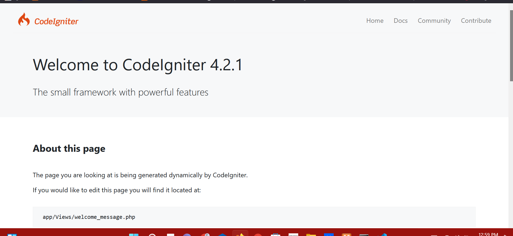

# Welcome to my github 
# Nama: Muhammad Rifai Aditiya
# Nim : 312010065
# Kelas: TI.20.A1
# Mata Kuliah : Web Pemrograman
# Web Pemrograman

Lab11Web

Dalam praktikum ini kita akan membuat program sederhana menggunakan Framework Codeigniter 4.
# Langkah - langkah praktikum

# 1). Mengaktifkan ekstentsi tersebut, melalu XAMPP Control Panel, pada bagian apache klik Config -> PHP.ini


# 2). Pada bagian extention, hilangkan tanda ; (titik koma) pada ekstensi yang akan diaktifkan. Kemudian simpan kembali filenya dan restart Apache web server.


# 3). Instalasi Codeigniter 4

Untuk melakukan instalasi Codeigniter 4 dapat dilakukan dengan dua cara, yaitu cara manual dan menggunakan composer. Pada praktikum ini kita menggunakan cara manual. Buka browser dengan alamat http://localhost/Lab11Web/lab11_php_ci/ci4/public/



# 4). Menjalankan CLI (Command Line Interface)

Menjalankan CLI (Command Line Interface) Codeigniter 4 menyediakan CLI untuk mempermudah proses development. Untuk mengakses CLI buka terminal/command prompt. 


Arahkan lokasi direktori sesuai dengan direktori kerja project dibuat (xampp/htdocs/Lab11Web/lab11_php_ci/ci4) Perintah yang dapat dijalankan untuk memanggil CLI Codeigniter adalah:

```CLI

php spark

```


5). Mengaktifkan Mode Debugging

Codeigniter 4 menyediakan fitur debugging untuk memudahkan developer untuk mengetahui pesan error apabila terjadi kesalahan dalam membuat kode program. Secara default fitur ini belum aktif. Ketika terjadi error pada aplikasi akan ditampilkan pesan kesalahan seperti berikut.


Semua jenis error akan ditampilkan sama. Untuk memudahkan mengetahui jenis errornya, maka perlu diaktifkan mode debugging dengan mengubah nilai konfigurasi pada environment variable CI_ENVIRONMENT menjadi development.


Ubah nama file env menjadi .env kemudian buka file tersebut dan ubah nilai variable CI_ENVIRONMENT menjadi development.


Contoh error yang terjadi. Untuk mencoba error tersebut, ubah kode pada file app/Controller/Home.php hilangkan titik koma pada akhir kode.


6). Membuat Routes Baru

Tambahkan code pada routes.php
```php
$routes->get('/about', 'Page::about');
$routes->get('/contact', 'Page::contact');
$routes->get('/faqs', 'Page::faqs');
```


Untuk mengetahui route yang ditambahkan sudah benar, buka CLI dan jalankan perintah berikut.

```php
php spark routes
```


Selanjutnya coba akses route yang telah dibuat dengan mengakses alamat url http://localhost:8080/about


etika diakses akan mucul tampilan error 404 file not found, itu artinya file/page tersebut tidak ada. Untuk dapat mengakses halaman tersebut, harus dibuat terlebih dahulu Contoller yang sesuai dengan routing yang dibuat yaitu Contoller Page.
# 7). Membuat Controller

Selanjutnya adalah membuat Controller Page. Buat file baru dengan nama page.php pada direktori Controller kemudian isi kodenya seperti berikut.
```php
<?php

namespace App\Controllers;

class Page extends BaseController
{
    public function about()
    {
        echo "Ini halaman About";
    }
    public function contact()
    {
        echo "Ini halaman Contact";
    }
    public function faqs()
    {
        echo "Ini halaman FAQ";
    }
}
```
Berikut hasil run


# 8). Auto Routing

Secara default fitur autoroute pada Codeiginiter sudah aktif. Untuk mengubah status autoroute dapat mengubah nilai variabelnya. Untuk menonaktifkan ubah nilai true menjadi false.

```php
$routes->setAutoRoute(true);
```
Tambahkan method baru pada Controller Page seperti berikut.
```php
  public function tos()
    {
        echo "ini halaman Term of Services";
    }
```
Method ini belum ada pada routing, sehingga cara mengaksesnya dengan menggunakan alamat:http://localhost:8080/page/tos


9). Membuat View

Selanjutnya adalam membuat view untuk tampilan web agar lebih menarik. Buat file baru dengan nama about.php pada direktori view (app/view/about.php) kemudian isi kodenya seperti berikut.
```php
<!DOCTYPE html>
<html lang="en">
<head>
    <meta charset="UTF-8">
    <title><?= $title; ?></title>
</head>
<body>
    <h1><?= $title; ?></h1>
    <hr>
    <p><?= $content; ?></p>
</body>
</html>
```
Ubah method about pada class Controller Page menjadi seperti berikut:
```php
public function about()
    {
        return view('about', [
            'title' => 'Halaman About',
            'content' => 'Ini adalah halaman about yang menjelaskan tentang isi halaman ini.'
        ]);
    }
```


# 10). Membuat Layout Web dengan CSS

Pada dasarnya layout web dengan css dapat diimplamentasikan dengan mudah pada codeigniter. Yang perlu diketahui adalah, pada Codeigniter 4 file yang menyimpan asset css dan javascript terletak pada direktori public.

Buat file css pada direktori public dengan nama style.css (copy file dari praktikum lab4_layout. Kita akan gunakan layout yang pernah dibuat pada praktikum 4.


# 10). Membuat Layout Web dengan CSS

Pada dasarnya layout web dengan css dapat diimplamentasikan dengan mudah pada codeigniter. Yang perlu diketahui adalah, pada Codeigniter 4 file yang menyimpan asset css dan javascript terletak pada direktori public.

Buat file css pada direktori public dengan nama style.css (copy file dari praktikum lab4_layout. Kita akan gunakan layout yang pernah dibuat pada praktikum 4.


